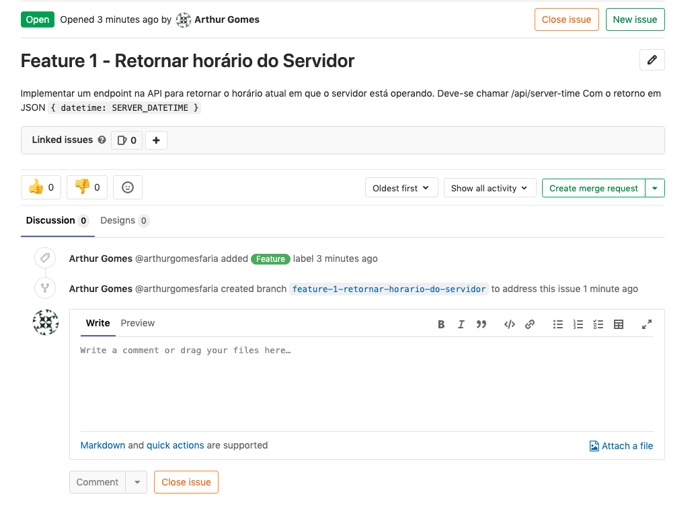
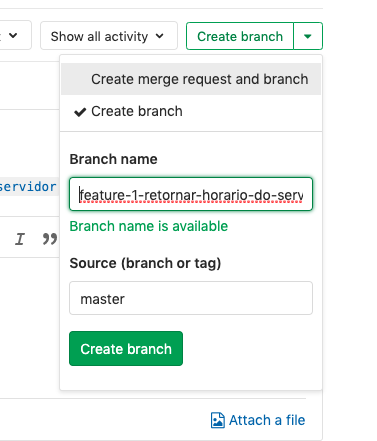
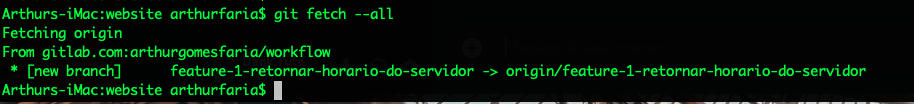
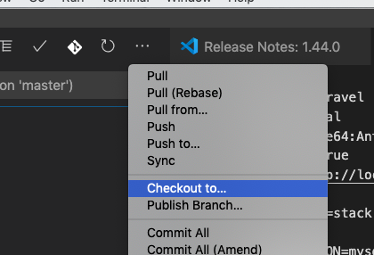
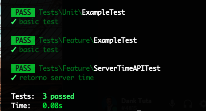
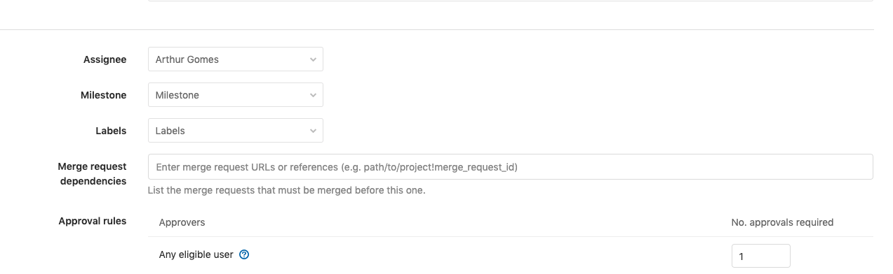
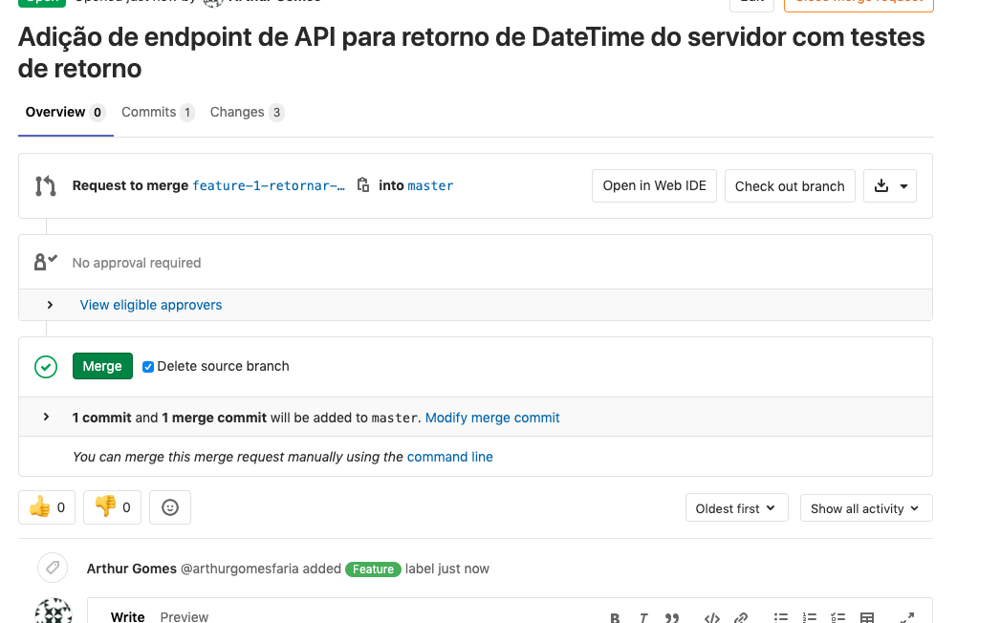

### Adicionando uma feature no código

Antes de começar, verifique se está na pasta do repositório clonado e execute os comandos (caso não tenha executado ainda):

```bash
laravel new workflow
cd workflow
cp .env.example .env
touch database.sqlite
```

Altere o arquivo `.env` para o apontamento do banco SQLite reflita o `database.sqlite` criado no comando anterior:

```
DB_CONNECTION=sqlite
DB_DATABASE=caminho completo para o database/database.sqlite
```

E finalmente, podemos gerar a chave do Laravel e subir a aplicação com os comandos:
```bash
php artisan key:generate
php artisan serve
```

#### Configuração de branches e políticas


##### Adição de uma Feature

> Any significant change to the code should start with an issue that describes the goal. Having a reason for every code change helps to inform the rest of the team and to keep the scope of a feature branch small. In GitLab, each change to the codebase starts with an issue in the issue tracking system. If there is no issue yet, create the issue, as long as the change will take a significant amount of work, i.e., more than 1 hour. In many organizations, raising an issue is part of the development process because they are used in sprint planning. The issue title should describe the desired state of the system. For example, the issue title “As an administrator, I want to remove users without receiving an error” is better than “Admin can’t remove users.”


1. Criar uma Issue no projeto e definir como Feature Request

Vamos definir um critério de aceitação onde o retorno deve ser um objeto JSON do formato

```json
{
	"datetime": "SERVER_DATETIME"
}
```


2. Adicionar uma pessoa para resolver e criar um label para definir que é uma feature.



2. No quadro de Issues, visualizar e abrir um novo branch para começar o trabalho.





 


3. Trocar para o branch e começar a desenvolver.

Vamos primeiro criar uma pasta em App/Http/Controllers chamada `API`, e então um arquivo chamado `TimeController.php`, que cuidará das requisições sobre o tempo do servidor.

Note que o retorno 
```php
<?php
   
namespace App\Http\Controllers\API;
   
use Illuminate\Http\Request;
use App\Http\Controllers\Controller as Controller;
use Carbon\Carbon;

class TimeController extends Controller
{
    /**
     * Display a listing of the resource.
     *
     * @return \Illuminate\Http\Response
     */
    public function index()
    {
        $response = [
            'datetime' => Carbon::now()
        ];

        return response()->json($response, 200);
    }
}
```

E então alterar a rota

```php
Route::middleware([])->group( function () {
    Route::get('server-time', 'API\TimeController@index');
});
```


4. E como somos bons desenvolvedores, sempre que adicionamos uma coisa nova, criamos testes para ela.

```bash
php artisan make:test ServerTimeAPITest
```

```php
<?php

namespace Tests\Feature;

use Illuminate\Foundation\Testing\RefreshDatabase;
use Illuminate\Foundation\Testing\WithFaker;
use Tests\TestCase;

class ServerTimeAPITest extends TestCase
{
    /**
     * Testing return format
     *
     * @return void
     */
    public function testRetornoServerTime() {
        $response = $this->get('/api/server-time');
        $response->assertStatus(200);
        $response->assertJsonStructure([
            'datetime'
        ]);
        $regex = '/\d{4}-[01]\d-[0-3]\dT[0-2]\d:[0-5]\d:[0-5]\d(?:\.\d+)?Z?/m';
        $this->assertEquals(preg_match_all($regex, $response['datetime']), 1);
    }
}

```

```bash
php artisan test
```





**Extra** - Tente criar um teste que espera uma falha do retorno, como por exemplo um formato ruim.

Agora com tudo criado, vamos publicar nossas alterações e realizar um Merge Request








##### Geração de uma versão

Vamos então gerar uma versão criando um novo branch a partir do master


