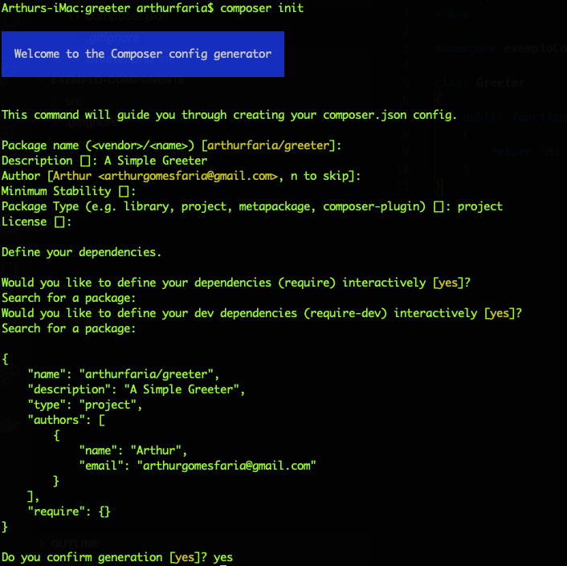
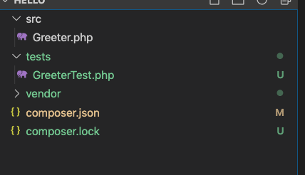
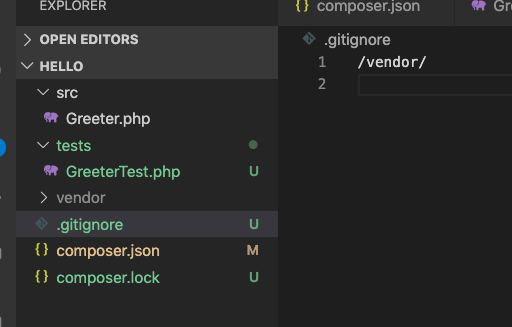
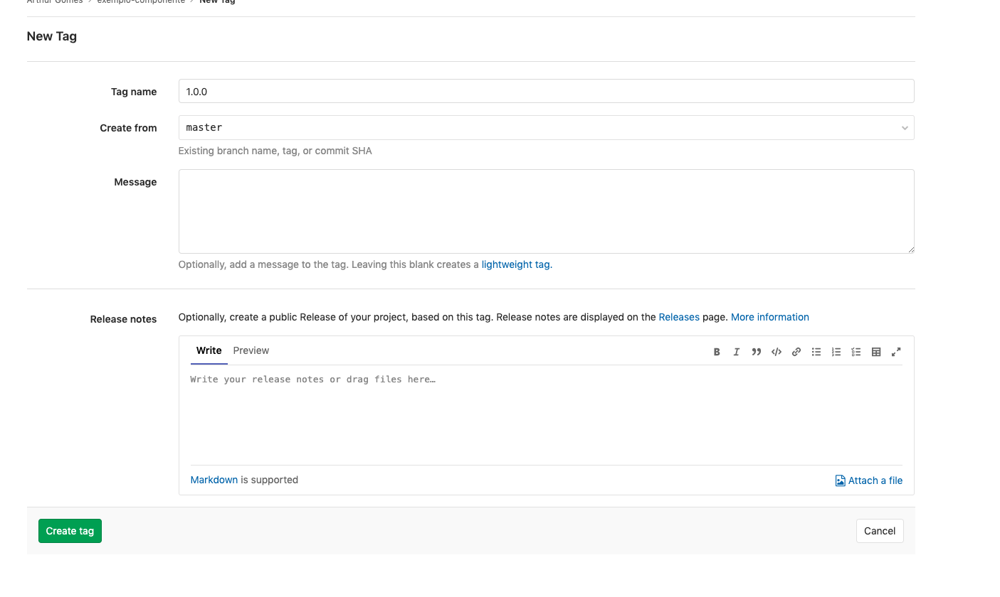
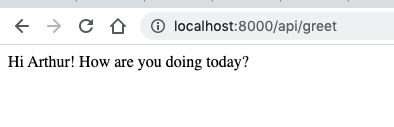

> Objetivo - como são utilizados vários pacotes composer para manter uma aplicação Laravel, vamos também utilizar a gerência de configuração e controle de versão em um pacote, criando uma branch de release com sua versão.

https://medium.com/simplex-internet-blog/build-your-own-laravel-package-in-10-minutes-using-composer-867e8ef875dd

O controle de versionamento de dependências, quais versões estão em uso e quando devem ser atualizadas, pode ser feita inteiramente através dos arquivos composer.json e composer.lock. Note que é sempre possível definir versões variáveis que se atualizam utilizando o operador `^`. Sempre que quisermos então atualizar as versões dos pacotes, basta executar o comando `composer update`, recomendado para que as dependências sempre estejam com as últimas versões e com bugs mais recentes corrigidos.

Mas como o objetivo é configurar uma nova dependência, vamos criar um novo pacote =). Ele retornará uma mensagem de Greeting para o nome passado como parâmetro. Claro, poderíamos fazer muuuito mais, mas por enquanto vamos para o simples e rápido.


Primeiro, criamos um projeto no GitLab, daremos o nome de **Greeter**.

Depois de cloná-lo, vamos executar os comandos:

```bash
composer init
```



E também instalar o `phpunit`, com o comando

```bash
composer require phpunit/phpunit
```

Vamos então alterar nosso compose.json e adicionar o campo de `autoload` para facilitar a configuração do componente no Laravel (dessa forma, não precisamos adicionar manualmente a injeção do pacote no laravel) e o script para testes:

```json
{
    "name": "arthurfaria/greeter",
    "description": "A simple Hello World Package",
    "type": "project",
    "license": "MIT",
  	"scripts": {
      "tests": "phpunit tests"
    },
    "authors": [
        {
            "name": "Arthur",
            "email": "arthurgomesfaria@gmail.com"
        }
    ],
    "autoload": {
        "psr-4": {
            "Arthurfaria\\Greeter\\": "src/"
        }
    },
    "require": {}
}

```

Criamos uma pasta `src` e então um Arquivo `Greeter.php` com o conteúdo:

```php
<?php

namespace Arthurfaria\Greeter;

class Greeter
{
    public function greet(String $sName)
    {
        return 'Hi ' . $sName . '! How are you doing today?';
    }
}
```

E uma pasta `tests` com um arquivo `GreeterTest.php` com o conteúdo:

```php
<?php

namespace Tests;

use PHPUnit\Framework\TestCase;
use Arthurfaria\Greeter\Greeter;

class GreeterTest extends TestCase
{
    /**
     * A basic test example.
     *
     * @return void
     */
    public function testGreeter()
    {
        $greeter = new Greeter();
        $sName = "SEBRAE";
        $this->assertTrue('Hi ' . $sName . '! How are you doing today?' == $greeter->greet($sName));
    }
}
```


Ficamos então com a estrutura:




E claro, um .gitignore é sempre útil:



Vamos então adicionar ao controle de versão, realizar o push e verificar os arquivos através da interface web do GitLab.

Então, vamos adicionar uma Tag, de preferência 1.0.0 para marcar nossa primeira versão.



Pronto! Agora basta ir no projeto anterior e alterar as configurações do `composer.json` adicionando a nova dependência:

```json
.
.
.
"require": {
        "php": "^7.2.5",
        "fideloper/proxy": "^4.2",
        "fruitcake/laravel-cors": "^1.0",
        "guzzlehttp/guzzle": "^6.3",
        "laravel/framework": "^7.0",
        "laravel/tinker": "^2.0",
        "arthurfaria/greeter": "^1.0.0"
    },
    "repositories": [
        {
            "type": "vcs",
            "url": "https://gitlab.com/arthurgomesfaria/hello"
        }
    ],
    .
    .
    .
    
```

E finalmente, podemos alterar nossas rotas para já retornar o pacote:

```php
<?php

use Illuminate\Http\Request;
use Illuminate\Support\Facades\Route;
use Arthurfaria\Greeter\Greeter;
/*
|--------------------------------------------------------------------------
| API Routes
|--------------------------------------------------------------------------
|
| Here is where you can register API routes for your application. These
| routes are loaded by the RouteServiceProvider within a group which
| is assigned the "api" middleware group. Enjoy building your API!
|
*/

Route::middleware('auth:api')->get('/user', function (Request $request) {
    return $request->user();
});

Route::middleware([])->group( function () {
    Route::get('server-time', 'API\TimeController@index');
});

Route::middleware([])->get('/greet', function (Request $request) {
    $Greetr = new Greeter();
    return $Greetr->greet('Arthur');
});
```



